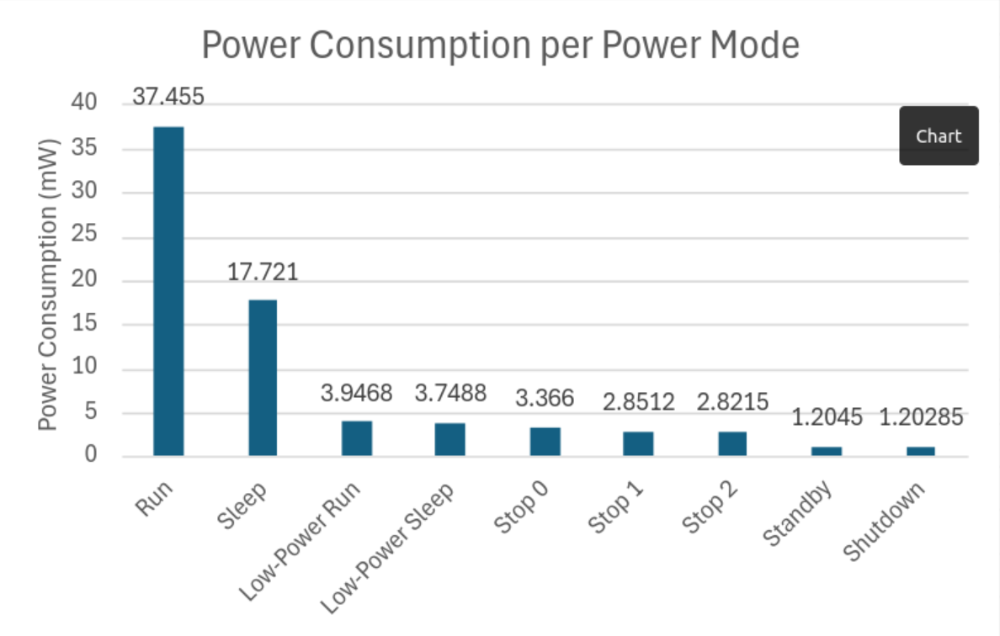

# Low power modes

| Mode              | Entery                                                | Wakeup                                                   | Clocks                   |
| ----------------- | ----------------------------------------------------- | -------------------------------------------------------- | ------------------------ |
| Sleep             | WFI/Return from ISR or WFE                            | Any Interrupt (Usart, Gpio, Timer, etc.) or Wakeup event | CPU CLock off            |
| Low-power Run     | Set LPR bit                                           | Clear LPR bit                                            | N/A                      |
| Low-power Sleep   | Set LPR bit & WFI/Return from ISR or WFE              | Any Interrupt (Usart, Gpio, Timer, etc.) or Wakeup event | CPU clock off            |
| Stop 0            | LPMS=000 & SLEEPDEEP bit & WFI/Return from ISR or WFE | Any EXTI line or certain peripheral events (LPUart)      | Only LSI and LSE enabled |
| Stop 1            | LPMS=001 & SLEEPDEEP bit & WFI/Return from ISR or WFE | Any EXTI line or certain peripheral events (LPUart)      | Only LSI and LSE enabled |
| Stop 2            | LPMS=010 & SLEEPDEEP bit & WFI/Return from ISR or WFE | Any EXTI line or certain peripheral events (LPUart)      | Only LSI and LSE enabled |
| Standby           | LPMS=011 & SLEEPDEEP bit & WFI/Return from ISR or WFE | WKUP pin edge, RTC event, NRST pin, IWDG reset           | Only LSI and LSE enabled |
| Shutdown          | LPMS=1-- & SLEEPDEEP bit & WFI/Return from ISR or WFE | WKUP pin edge, RTC event, NRST pin                       | Only LSE enabled         |

* #### Definitions:
    * WFI - Wait for interrupt assembly command
    * WFE - Wait for event assembly command
    * Return from ISR - Returning from any interrupt function
    * Wakeup Event - Wakeup events can be configured to occur for many reasons, and are very abstract
    * LSI - Low speed internal clock
    * LSE - Low speed external clock
    * WKUP pin - Certain GPIO pins are able to wakeup the CPU on an edge detection
    * NRST pin - Pin on the board that force resets the CPU without power cycling
    * EXTI line - External interrupt on GPIO pins that are activated by pulling the pin high or low

## Caveats
* **Low-power sleep**: In order to enter low-power sleep, the CPU must first be in low-power run mode
* **Stop modes**: All 3 of these modes persist through power cycles, so turning the board on and off again will not put it back into run mode, it will stay in the mode it was before it lost power
* **Standby and Shutdown modes**: These modes also require clearing WUF bits in power status register 1 (PWR_SR1)
    * **Power status register 1 is read-only, so they are cleared by writing a 1 to the CWUF bits in the power status clear register (PWR_SCR)**
* If the board gets stuck in any power mode, it cannot be flashed the same way. The only way to flash a board that is in a low power mode is to pull the NRST pin to GND, then pull the BOOT pin to 3.3V, and then removing the GND from the NRST pin. This will force the board into bootmode where it can be flashed

## Example

#### blink-timer-low-power.c
```C
int main(void) {
  /** Setup GPIO pins to control LEDs */
  rcc_periph_clock_enable(RCC_GPIOC);
  gpio_mode_setup(GPIOC, GPIO_MODE_OUTPUT, GPIO_PUPD_NONE, GPIO10);
  gpio_mode_setup(GPIOC, GPIO_MODE_OUTPUT, GPIO_PUPD_NONE, GPIO12);
  gpio_set(GPIOC, GPIO10);
  gpio_clear(GPIOC, GPIO12);

  /** Setup the timer to call the interrupt */
  rcc_periph_clock_enable(RCC_TIM2);
  timer_set_mode(TIM2, TIM_CR1_CKD_CK_INT_MUL_2, TIM_CR1_CMS_EDGE, TIM_CR1_DIR_UP);
  timer_set_period(TIM2, 1250000);
  timer_enable_irq(TIM2, TIM_DIER_UIE);
  nvic_enable_irq(NVIC_TIM2_IRQ);
  timer_enable_counter(TIM2);

  /** Enable sleep mode */
  scb_clear_sleepdeep();        // Clear SLEEPDEEP bit to make sure the MCU goes into the correct power mode
  scb_set_sleeponexit();        // Enable sleep when exiting from an interrupt

  __asm__("wfi");               // Wait for the first interrupt
}

/** Timer Interrupt */
void tim2_isr(void) {
  timer_clear_flag(TIM2, TIM_SR_UIF);   // clear flag so timer will continue counting
  gpio_toggle(GPIOC, GPIO10);           // blinks LED
  gpio_toggle(GPIOC, GPIO12);           // blinks LED
}
```
This file blinks the LEDs identically to blink-timer.c while reducing the power consumption

## Registers

### System Control Register: SCB_SCR
| 31 | 30 | 29 | 28 | 27 | 26 | 25 | 24 | 23 | 22 | 21 | 20 | 19 | 18 | 17 | 16 |
|:----:|:----:|:----:|:----:|:----:|:----:|:----:|:----:|:----:|:----:|:----:|:----:|:----:|:----:|:----:|:----:|
|  X |  X |  X |  X |  X |  X |  X |  X |  X |  X |  X |  X |  X |  X |  X |  X |
|**15**|**14**|**13**|**12**|**11**|**10**|**9**|**8**|**7**|**6**|**5**|**4**|**3**|**2**|**1**|**0**|
|  X |  X |  X |  X |  X |  X |  X |  X |  X |  X |  X |  X |  X | SLEEPDEEP | SLEEPONEXIT |  X |

* **SLEEPDEEP**: Controls whether the processor uses sleep or deep sleep as its power mode
    * 0: Sleep
    * 1: Deep sleep
* **SLEEPONEXIT**: Configures the CPU to automatically go to sleep when returning from an interrupt (Return from ISR)
    * 0: Do not sleep when returning from an interrupt
    * 1: Enter sleep or deep sleep when returning from an interrupt


### Power Control 1 Register: PWR_CR1
| 31 | 30 | 29 | 28 | 27 | 26 | 25 | 24 | 23 | 22 | 21 | 20 | 19 | 18 | 17 | 16 |
|:----:|:----:|:----:|:----:|:----:|:----:|:----:|:----:|:----:|:----:|:----:|:----:|:----:|:----:|:----:|:----:|
|  X |  X |  X |  X |  X |  X |  X |  X |  X |  X |  X |  X |  X |  X |  X |  X |
|**15**|**14**|**13**|**12**|**11**|**10**|**9**|**8**|**7**|**6**|**5**|**4**|**3**|**2**|**1**|**0**|
|  X | LPR |  X |  X |  X |  X |  X |  X |  X |  X |  X |  X |  X |  LPMS[2] |LPMS[1]|LPMS[0]|
* **LPR**: Low-power run
    * When this bit is set, the regulator is switched from main mode to low-power mode

* **LPMS**: Low Power Mode Selection
    * 000: Stop 0 mode
    * 001: Stop 1 mode
    * 010: Stop 2 mode
    * 011: Standby mode

### Power Status Clear Register: PWR_SCR
| 31 | 30 | 29 | 28 | 27 | 26 | 25 | 24 | 23 | 22 | 21 | 20 | 19 | 18 | 17 | 16 |
|:----:|:----:|:----:|:----:|:----:|:----:|:----:|:----:|:----:|:----:|:----:|:----:|:----:|:----:|:----:|:----:|
|  X |  X |  X |  X |  X |  X |  X |  X |  X |  X |  X |  X |  X |  X |  X |  X |
|**15**|**14**|**13**|**12**|**11**|**10**|**9**|**8**|**7**|**6**|**5**|**4**|**3**|**2**|**1**|**0**|
|  X |  X |  X |  X |  X |  X |  X |  X |  X |  X |  X | CWUF5 | CWUF4 | CWUF3 | CWUF2 | CWUF1 |

* **CWUF5**
    * Setting this bit clears the WUF5 flag in the PWR_SR1 register
* **CWUF4**
    * Setting this bit clears the WUF4 flag in the PWR_SR1 register
* **CWUF3**
    * Setting this bit clears the WUF3 flag in the PWR_SR1 register
* **CWUF2**
    * Setting this bit clears the WUF2 flag in the PWR_SR1 register
* **CWUF1**
    * Setting this bit clears the WUF1 flag in the PWR_SR1 register

Using these 3 registers we can change the power mode of the MCU


## Power Modes in TAB

| Mode              |       Entry      | Confirmation     | Wakeup                  | Power Usage |
|:-----------------:|:----------------:|:----------------:|:-----------------------:|:-----------:|
| Run               |:heavy_check_mark:|:heavy_check_mark:|:heavy_check_mark: Usart | 11.37 mA |
| Sleep             |:heavy_check_mark:|:heavy_check_mark:|:heavy_check_mark: Usart | 5.36 mA  |
| Low-power Run     |       :x:        |        :x:       |         :x:             |:question:|
| Low-power Sleep   |       :x:        |        :x:       |         :x:             |:question:|
| Stop 0            |:heavy_check_mark:|:heavy_check_mark:|:heavy_check_mark: GPIO  | 1.40 mA     |
| Stop 1            |:heavy_check_mark:|:heavy_check_mark:|:heavy_check_mark: GPIO  | 1.28 mA     |
| Stop 2            |:heavy_check_mark:|:heavy_check_mark:|         :x: In Progress | 1.28 mA     |
| Standby           |:heavy_check_mark:|:heavy_check_mark:|:heavy_check_mark: GPIO  | 0.25 mA    |
| Shutdown          |:heavy_check_mark:|:heavy_check_mark:|:heavy_check_mark: GPIO  | 0.38 mA     |

