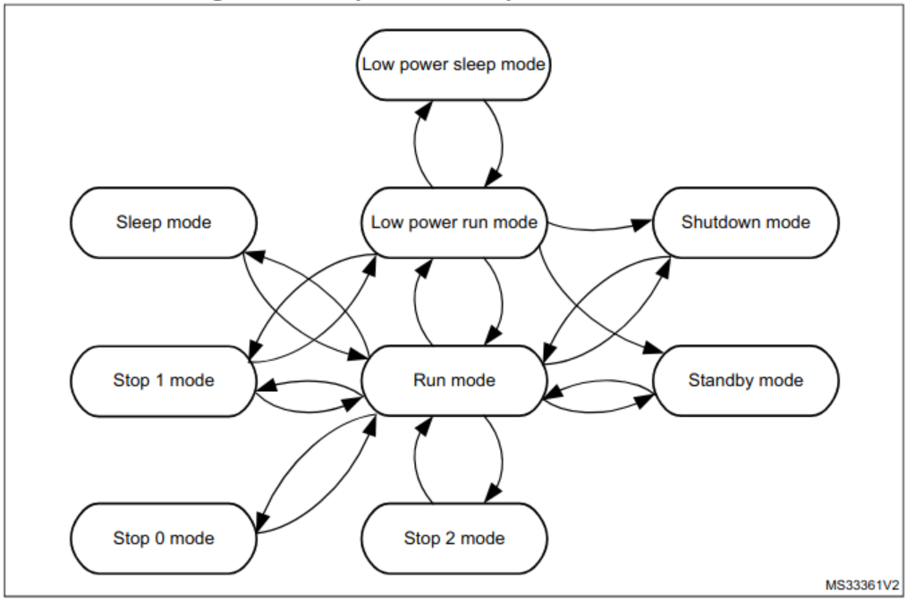

# Tartan Artibeus Experiment Board Low Power Software

```bash
cd ../../scripts/
source sourcefile.txt
cd ../software/low-power/
make
st-flash write low-power.bin 0x8000000
```

## Connecting USART

1. Connect the RX pin of the FTDI adapter to the TX pin of the ta-expt board
2. Connect the TX pin of the FTDI adapter to the RX pin of the ta-expt board
3. Connect the GND pin of the FTDI adapter to the GND pin of the ta-expt board
4. Setup the serial port in minicom so data can be sent to the board. To setup the serial port follow these instructions

```bash
minicom -s ta-expt
# Serial port setup
#   Serial Device: /dev/ttyUSB0
#   Bps/Par/Bits:  38400 8N1
#   Hardware Flow Control: No
#   Software Flow Control: No
#   Press Enter to accept
# Test that the configuration was successful:
minicom ta-expt
# Local echo (shows the chars you send over serial):
#   Ctrl-a e
# Exit minicom:
#   Ctrl-a x
```

## Running The Demo

Once the serial port is setup and the ta-expt connected, the board can be powered. Once the board turns on the leds will blink a few times before turning off completely. The LEDs will stay off until any data is sent over the USART. When the board recieves data from the USART, minicom will display 'Woke Up' and the LEDs will flash again. This cycle repeats indefinitely. To send data over the USART with minicom, just hit any key and it will be sent; waking the board.

## Power Modes

The MCU used on the ta-expt board is capable of 7 different power modes, ranging from the normal run mode, to stop modes that stop most functions. The main purpose of these modesa re to reduce the power consumption of the MCU by disabling certain features.

### Moving Between Modes

To move from one mode to another, you have to consider where you are starting as not every power mode can transition to every other mode. Certain modes can only be reached by first transitioning into another. A state transition matrix featuring every power mode is below. One example of an intermediate mode would be transitioning from Run mode into Low power sleep mode, which requires first transitioning into Low power run mode.



### Sleep Mode

This power mode demo currently only has sleep mode implemented, meaning that the options are very limited. This demo is also limited by the main function, however that could be easily adapted to other purposes. The ``pwr_enable_sleep_mode()`` function enters sleep through a "Wait for Interrupt" call, so once called the MCU will remain in sleep until an interrupt is triggered. In this example the interupt is triggered by recieving bytes via USART, but there are many other interrupt sources capable of waking the MCU (RTC, GPIO, I2C, SPI, etc).